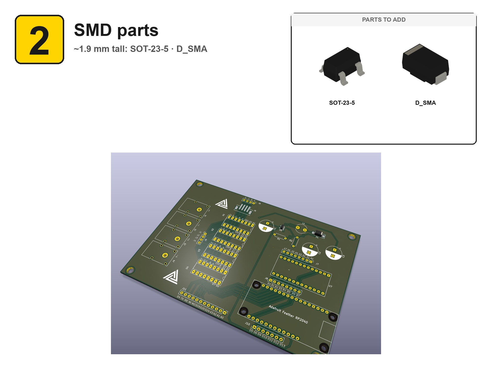
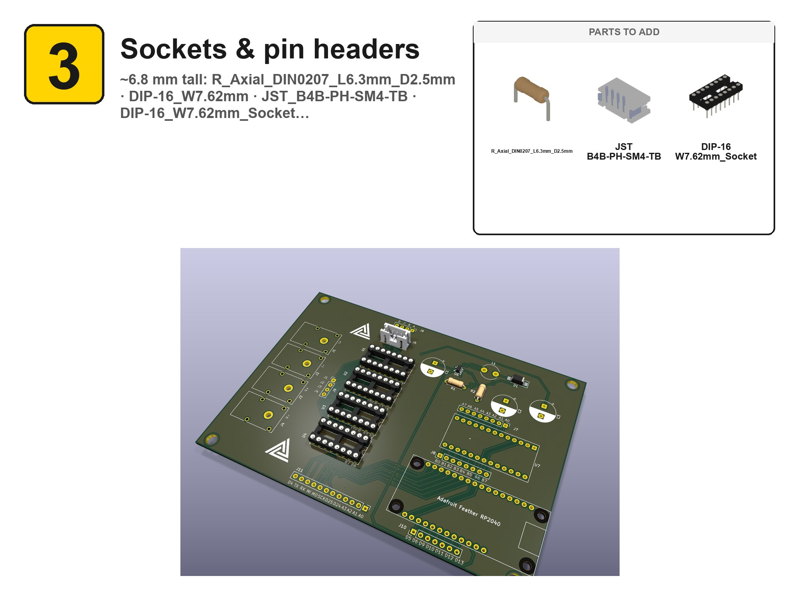
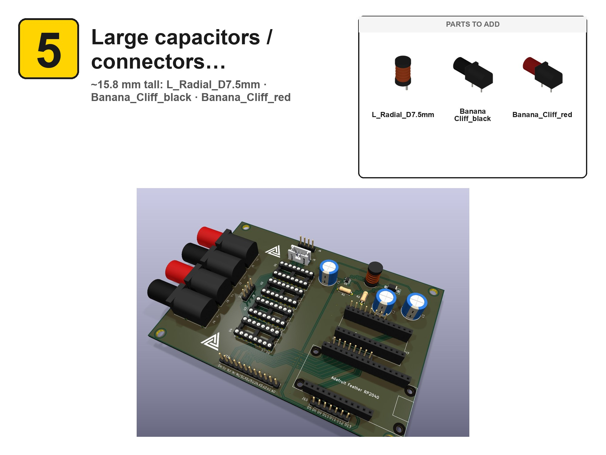

# OpenPauw — Assembly Guide

Hand-solder the board **shortest components first, tallest last** so the PCB lays flat through each step. 6 stage(s) below; the cumulative render at each step shows the board after that stage is finished.

📄 **[Printable single-PDF guide](media/assembly/OpenPauw_guide.pdf)**

## Stages

- [1. Bare PCB](#1-bare-pcb)
- [2. SMD parts](#2-smd-parts) — 2 part(s)
- [3. Sockets & pin headers](#3-sockets--pin-headers) — 3 part(s)
- [4. Inductors & small caps](#4-inductors--small-caps) — 8 part(s)
- [5. Large capacitors / connectors](#5-large-capacitors--connectors) — 3 part(s)
- [6. Daughterboards](#6-daughterboards) — 3 part(s)

---

### 1. Bare PCB

_Inspect: no shorts, silkscreen legible._

### 2. SMD parts

_~1.9 mm tall:  SOT-23-5 · D_SMA_

| Qty | Component | Label |
|----:|-----------|-------|
| ×1 | `SOT-23-5` | SOT-23-5 |
| ×1 | `D_SMA` | D_SMA |

### 3. Sockets & pin headers

_~6.8 mm tall:  R_Axial_DIN0207_L6.3mm_D2.5mm · DIP-16_W7.62mm · JST_B4B-PH-SM4-TB · DIP-16_W7.62mm_Socket_

| Qty | Component | Label |
|----:|-----------|-------|
| ×1 | `R_Axial_DIN0207_L6.3mm_D2.5mm` | R_Axial_DIN0207_L6.3mm_D2.5mm |
| ×1 | `JST_B4B-PH-SM4-TB` | JST_B4B-PH-SM4-TB |
| ×1 | `DIP-16_W7.62mm_Socket` | DIP-16_W7.62mm_Socket |

### 4. Inductors & small caps

_~11.6 mm tall:  PinHeader_1x04 · PinHeader_1x08 · PinHeader_1x07 · PinHeader_1x12 · PinSocket_1x13 · PinSocket_1x12 · PinSocket_1x16 · CP_Radial_D10.0mm_

| Qty | Component | Label |
|----:|-----------|-------|
| ×1 | `PinHeader_1x04` | PinHeader_1x04 |
| ×1 | `PinHeader_1x08` | PinHeader_1x08 |
| ×1 | `PinHeader_1x07` | PinHeader_1x07 |
| ×1 | `PinHeader_1x12` | PinHeader_1x12 |
| ×1 | `PinSocket_1x13` | PinSocket_1x13 |
| ×1 | `PinSocket_1x12` | PinSocket_1x12 |
| ×1 | `PinSocket_1x16` | PinSocket_1x16 |
| ×1 | `CP_Radial_D10.0mm` | CP_Radial_D10.0mm |

### 5. Large capacitors / connectors

_~15.8 mm tall:  L_Radial_D7.5mm · Banana_Cliff_black · Banana_Cliff_red_

| Qty | Component | Label |
|----:|-----------|-------|
| ×1 | `L_Radial_D7.5mm` | L_Radial_D7.5mm |
| ×1 | `Banana_Cliff_black` | Banana_Cliff_black |
| ×1 | `Banana_Cliff_red` | Banana_Cliff_red |

### 6. Daughterboards

_Seat boards onto their headers last:  5346-MCP23017-Expander · 4884_Feather_RP2040_

| Qty | Component | Label |
|----:|-----------|-------|
| ×1 | `5346-MCP23017-Expander` | 5346-MCP23017-Expander |
| ×1 | `4884_Feather_RP2040` | 4884_Feather_RP2040 |
| ×1 | `DIP-16_W7.62mm` | DIP-16_W7.62mm |

---

_Generated by [kibuilder](https://github.com/) from `OpenPauw.kibuilder.yaml`._
